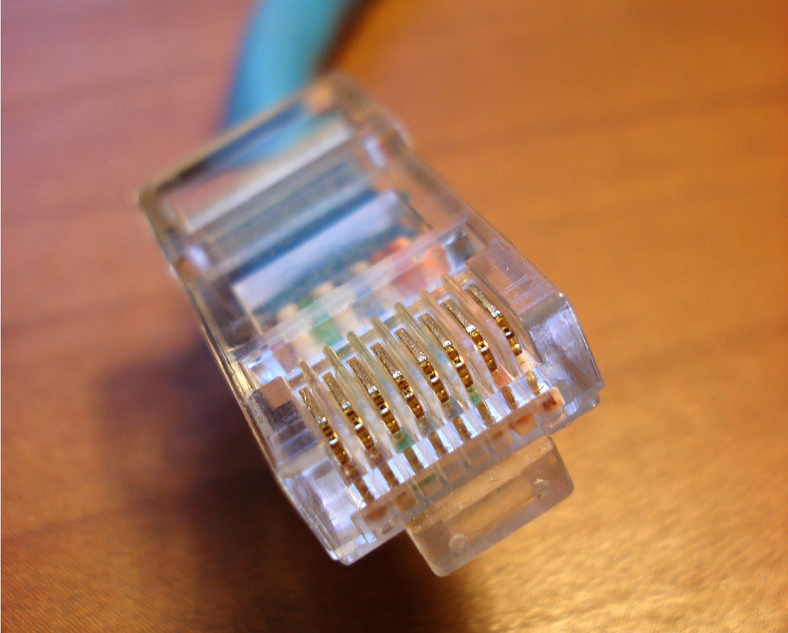

# rj45

pistacja, racja, prokrastynacja, dewiacja, akacja, radiacja, stacja, korelacja, penetracja, wariacja, reakcja, kastracja, karnacja, stagnacja, edukacja, akceptacja, implementacja, dekrementacja, konsultacja, prezentacja, modyfikacja, transformacja
skibidi dob dob dob yes yes skibidi dob dob dib dib